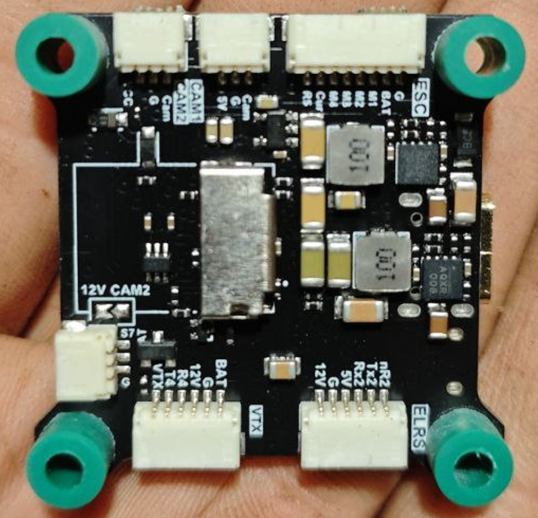
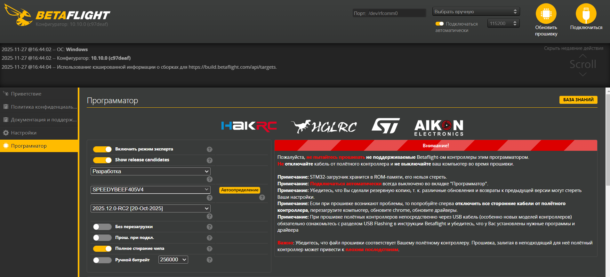
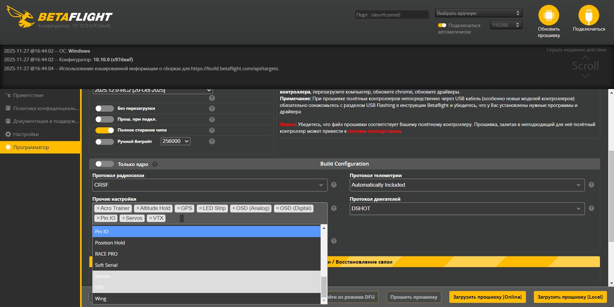

## Контроллер ниезвестный предположительно GENERIC F4
---
Подошла прошивка SpeedyBeeF405v4 от Betaflight заливаем vesion 4.6.0
---
Вверхная сторона

---
Нижная сторона

---
## Что бы появилься режим ALTHOLD:
1. Контроллер в режим DFU 
2. Открываем Betaflight Configurator -> программатор
3. Выбераем прошивку в разработке -> плату SPEEDYBEEF405V4 -> 2025.12.0[20-oct-2025] 
4. Прочие настройки добавляем ALTHOLD, POSHOLD, SERVOS 
5. Заливаем
6. Копируем весь техт файла PSEVDO_SPEEDYBEEF405V4.txt и вставляем CLI конфигиратора в конце save.
---
Пин:
1. мотор 7 сервопривод камеры
2. мотор 4 сервопрривод сброс