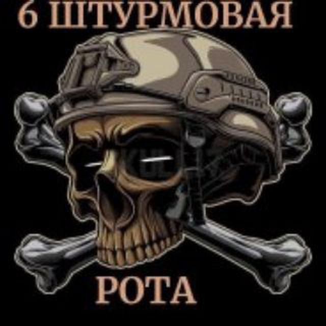
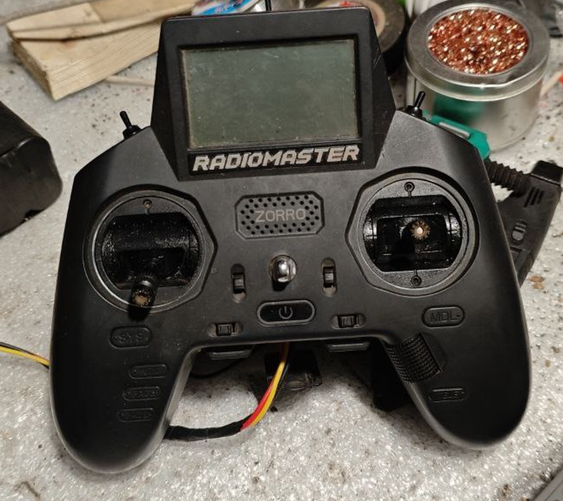
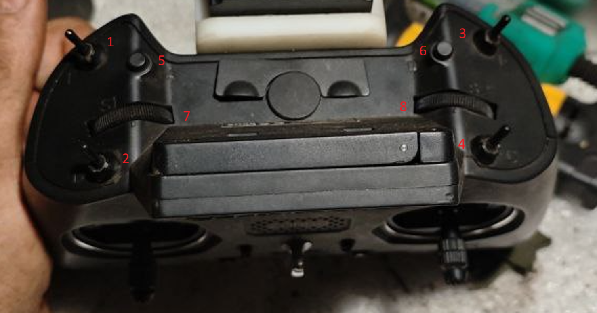

## ДЛЯ ПРОЕКТОВ ИСПОЛЬЗОВАЛЬСЯ ПУЛЬТ RADIOMASTER ZORRO

## AUX

1. ARM и DESARM
2. POWER VTX - мощность видеопередатчика
3. MODE - режимы полета
4. неопределен
5. OSD - преключение osd
6. Сброс - сурвопривод сброса
7. Gimble - сервопривод камеры
8. неопределен
